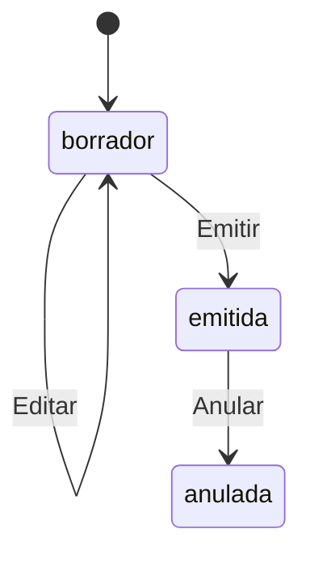

# Requisitos de integración del frontend con SIARE

Este documento define el contrato que debe consumir el frontend de SIARE y los requisitos funcionales, técnicos y de permisos que debe implementar. Está basado en el backend vigente al 21 de junio de 2026.

## 1. Alcance funcional del frontend

El frontend debe proporcionar, según el rol autenticado:

- Inicio, renovación y cierre de sesión.
- Dashboard con resumen de inventario y últimos movimientos.
- Administración de usuarios.
- Administración y consulta de catálogos.
- Creación, edición, emisión, consulta, anulación y descarga de actas de ingreso.
- Creación, edición, emisión, consulta, anulación y descarga de actas de entrega.
- Consulta del historial de movimientos de inventario.
- Registro de ajustes manuales de stock.
- Manejo uniforme de permisos, errores, cargas, estados vacíos y confirmaciones.

El backend no proporciona eliminación física de registros. El frontend no debe mostrar botones de eliminar; donde exista el campo `active`, debe utilizar activación o desactivación.

## 2. Configuración de conexión

### 2.1 URL base

En desarrollo:

```text
http://localhost:3000/api/v1
```

La URL debe configurarse mediante una variable de entorno del frontend, por ejemplo:

```env
VITE_API_URL=http://localhost:3000/api/v1
```

No se debe codificar la URL directamente en componentes.

### 2.2 CORS y cookies

El origen exacto del frontend debe estar incluido en `CORS_ORIGINS` del backend. El valor de desarrollo previsto es:

```text
http://localhost:5173
```

Todas las solicitudes de autenticación deben incluir credenciales:

```ts
fetch(url, {
  credentials: 'include',
});
```

Si se utiliza Axios:

```ts
const api = axios.create({
  baseURL: import.meta.env.VITE_API_URL,
  withCredentials: true,
});
```

La cookie `siare_refresh` es `HttpOnly`, `SameSite=Strict` y está limitada a `/api/v1/auth`. El frontend nunca podrá ni deberá leerla con JavaScript.

### 2.3 Límites globales

- Tamaño máximo del cuerpo: 1 MiB.
- Tiempo máximo normal de solicitud: 20 segundos.
- Límite global: 120 solicitudes por minuto.
- Inicio de sesión: 5 intentos por minuto.
- Renovación de sesión: 10 intentos por minuto.
- No enviar propiedades adicionales que no aparezcan en los contratos: el backend las rechaza.

## 3. Convenciones del contrato

### 3.1 Nombres de propiedades

- Los cuerpos enviados por el frontend usan `camelCase`.
- Las respuestas del backend usan principalmente `snake_case` porque reflejan nombres de PostgreSQL.
- No aplicar una conversión automática global sin probarla: algunas respuestas incluyen propiedades calculadas como `registered_by`, `latestMovements` o `institution_name`.

Ejemplo:

```json
{
  "materialId": "15",
  "unitValue": 12.5
}
```

La respuesta puede incluir:

```json
{
  "material_id": "15",
  "unit_value": "12.50"
}
```

### 3.2 Tipos base

```ts
type Id = string;
type DecimalString = string;
type DateOnly = string; // YYYY-MM-DD
type IsoDateTime = string; // ISO 8601

type Role = 'administrador' | 'asistente_actas' | 'consulta';
type ActStatus = 'borrador' | 'emitida' | 'anulada';
type LeaderPosition = 'rector' | 'director';
type MovementType = 'entrada' | 'salida' | 'ajuste' | 'anulacion';
```

Consideraciones obligatorias:

- Los identificadores `bigint` llegan como texto. No convertirlos a `number`.
- Los campos PostgreSQL `numeric` llegan como texto, por ejemplo `"12.50"`.
- Los formularios deben enviar cantidades, porcentajes y valores monetarios como números JSON.
- Para operar decimales en el frontend, usar una librería decimal o limitarse a una previsualización. Los totales definitivos son los devueltos por el backend.
- Los valores `date` se envían como `YYYY-MM-DD`.
- No construir fechas de formulario con `new Date('YYYY-MM-DD')`, porque puede cambiar el día según la zona horaria.
- Los timestamps se reciben como ISO 8601 y pueden formatearse para presentación.

### 3.3 Respuesta paginada

Todos los listados paginados responden:

```ts
interface PaginatedResponse<T> {
  data: T[];
  pagination: {
    page: number;
    pageSize: number;
    total: number;
    pages: number;
  };
}
```

Parámetros comunes:

| Parámetro  |   Tipo | Regla                                    |
| ---------- | -----: | ---------------------------------------- |
| `page`     | entero | Mínimo 1; predeterminado 1               |
| `pageSize` | entero | Entre 1 y 100; predeterminado 20         |
| `search`   |  texto | Máximo 200; solo usar donde se documenta |

### 3.4 Respuesta individual

La mayoría de las operaciones individuales responden:

```ts
interface DataResponse<T> {
  data: T;
}
```

Las excepciones son login, refresh, logout, health y PDF.

## 4. Autenticación y sesión

### 4.1 Flujo requerido

1. Enviar email y contraseña a `POST /auth/login` con `credentials: 'include'`.
2. Guardar el `accessToken` en memoria y guardar el objeto `user` en el estado de sesión.
3. Enviar `Authorization: Bearer <accessToken>` en toda ruta privada.
4. Cuando una solicitud devuelva `401`, ejecutar una sola renovación compartida mediante `POST /auth/refresh`.
5. Si la renovación funciona, actualizar el access token y reintentar una sola vez la solicitud original.
6. Si falla, limpiar el estado local y redirigir a login.
7. Al recargar la aplicación, intentar `POST /auth/refresh` y luego `GET /auth/me` para restaurar la sesión.
8. Al cerrar sesión, llamar `POST /auth/logout`, limpiar el token en memoria y volver a login.

Evitar varias renovaciones simultáneas: todas las solicitudes que reciban `401` deben esperar la misma promesa de refresh.

El access token dura 15 minutos por defecto. La cookie de renovación dura 7 días por defecto.

### 4.2 Almacenamiento recomendado

- Mantener el access token en memoria.
- No guardar la cookie de renovación manualmente.
- Evitar `localStorage` para el access token si no es imprescindible.
- El backend vuelve a comprobar que el usuario esté activo y que el rol del token coincida con el rol actual.
- Un cambio de rol puede producir un `401`; la renovación obtiene un token con el rol actualizado.

### 4.3 Endpoints de autenticación

#### `POST /auth/login`

Público.

```ts
interface LoginBody {
  email: string; // email válido, máximo 150
  password: string; // 8 a 200 caracteres
}
```

Respuesta `200`:

```ts
interface LoginResponse {
  accessToken: string;
  tokenType: 'Bearer';
  user: {
    id: Id;
    name: string;
    email: string;
    role: Role;
    position: string | null;
  };
}
```

#### `POST /auth/refresh`

Público, pero requiere la cookie `HttpOnly` enviada mediante credenciales.

Respuesta `200`:

```ts
interface RefreshResponse {
  accessToken: string;
  tokenType: 'Bearer';
}
```

La sesión de renovación rota en cada uso. No reutilizar respuestas antiguas ni disparar refresh en paralelo.

#### `POST /auth/logout`

Idempotente. Enviar credenciales y, si aún existe, el bearer token.

```json
{ "message": "Sesión cerrada" }
```

#### `GET /auth/me`

Requiere bearer token. Responde:

```ts
interface CurrentUser {
  id: Id;
  name: string;
  email: string;
  role: Role;
  position: string | null;
  active: boolean;
}
```

## 5. Roles y permisos

El frontend debe ocultar navegación y acciones no autorizadas. El backend continúa siendo la fuente final de autorización.

### 5.1 Matriz funcional

| Módulo o acción                                  | Administrador | Asistente de actas | Consulta |
| ------------------------------------------------ | :-----------: | :----------------: | :------: |
| Dashboard / resumen de inventario                |      Sí       |         Sí         |    Sí    |
| Usuarios: listar, crear y editar                 |      Sí       |         No         |    No    |
| Categorías: consultar                            |      Sí       |         Sí         |    Sí    |
| Categorías: crear y editar                       |      Sí       |         No         |    No    |
| Unidades de medida: consultar                    |      Sí       |         Sí         |    Sí    |
| Unidades de medida: crear y editar               |      Sí       |         No         |    No    |
| Autoridades distritales: consultar               |      Sí       |         No         |    No    |
| Autoridades distritales: crear y editar          |      Sí       |         No         |    No    |
| Instituciones: consultar                         |      Sí       |         Sí         |    Sí    |
| Instituciones: crear y editar                    |      Sí       |         No         |    No    |
| Líderes: consultar                               |      Sí       |         Sí         |    Sí    |
| Líderes: crear y editar                          |      Sí       |         No         |    No    |
| Materiales: consultar                            |      Sí       |         Sí         |    Sí    |
| Materiales: crear y editar                       |      Sí       |         No         |    No    |
| Procesos de adquisición: consultar               |      Sí       |         No         |    No    |
| Procesos de adquisición: crear y editar          |      Sí       |         No         |    No    |
| Actas de ingreso: consultar y PDF                |      Sí       |         Sí         |    Sí    |
| Actas de ingreso: crear, editar, emitir y anular |      Sí       |         No         |    No    |
| Actas de entrega: consultar y PDF                |      Sí       |         Sí         |    Sí    |
| Actas de entrega: crear, editar y emitir         |      Sí       |         Sí         |    No    |
| Actas de entrega: anular                         |      Sí       |         No         |    No    |
| Movimientos de inventario                        |      Sí       |         No         |    Sí    |
| Ajustes de inventario                            |      Sí       |         No         |    No    |

### 5.2 Menús recomendados por rol

`administrador`:

- Dashboard.
- Actas de ingreso.
- Actas de entrega.
- Inventario y ajustes.
- Usuarios.
- Todos los catálogos.

`asistente_actas`:

- Dashboard.
- Consulta de actas de ingreso.
- Gestión de actas de entrega.
- Catálogos de apoyo: categorías, unidades, instituciones, líderes y materiales.
- No mostrar movimientos, ajustes, usuarios, autoridades ni procesos de adquisición.

`consulta`:

- Dashboard.
- Consulta y PDF de ambas clases de acta.
- Movimientos de inventario.
- Catálogos de lectura: categorías, unidades, instituciones, líderes y materiales.
- No mostrar ninguna acción de creación, edición, emisión, anulación o ajuste.

## 6. Usuarios

Base: `/users`. Solo `administrador`.

### 6.1 Contrato de usuario

```ts
interface User {
  id: Id;
  name: string;
  email: string;
  role: Role;
  position: string | null;
  active: boolean;
  created_at?: IsoDateTime;
  updated_at?: IsoDateTime;
}
```

### 6.2 Endpoints

| Método  | Ruta         | Uso                             | Respuesta            |
| ------- | ------------ | ------------------------------- | -------------------- |
| `GET`   | `/users`     | Listar                          | Paginada             |
| `GET`   | `/users/:id` | Consultar                       | `{ data: User }`     |
| `POST`  | `/users`     | Crear                           | `201 { data: User }` |
| `PATCH` | `/users/:id` | Actualizar o activar/desactivar | `{ data: User }`     |

Filtros de listado:

- `page`, `pageSize`.
- `search`: busca por nombre o email.
- `active`: booleano.

Cuerpo de creación:

```ts
interface CreateUserBody {
  name: string; // 2 a 150
  email: string; // email, máximo 150
  password: string; // 12 a 200
  role: Role;
  position?: string | null; // máximo 150
  active?: boolean; // predeterminado true
}
```

`PATCH` acepta cualquier subconjunto de esos campos, pero debe contener al menos uno.

Reglas de interfaz:

- No permitir desactivar la propia cuenta.
- Debe permanecer al menos un administrador activo.
- El email se normaliza a minúsculas.
- Mostrar el error `EMAIL_ALREADY_EXISTS` junto al campo email.
- Al cambiar contraseña, exigir al menos 12 caracteres.
- Si el usuario actual cambia su propio rol, refrescar `/auth/me` después de la operación.

## 7. Catálogos

Todos los listados son paginados. Las lecturas permitidas por rol están definidas en la matriz. Crear y editar cualquier catálogo requiere `administrador`.

Patrón común:

| Método  | Ruta              | Resultado                   |
| ------- | ----------------- | --------------------------- |
| `GET`   | `/<catálogo>`     | `{ data: T[], pagination }` |
| `POST`  | `/<catálogo>`     | `201 { data: T }`           |
| `PATCH` | `/<catálogo>/:id` | `{ data: T }`               |

No existen endpoints de detalle ni eliminación para catálogos. El frontend debe conservar el registro seleccionado desde el listado o recargar la página correspondiente.

### 7.1 Categorías: `/categorias`

Lectura: todos los roles. Escritura: administrador.

Filtros: `page`, `pageSize`, `search` por nombre y `active`.

```ts
interface CategoryBody {
  name: string; // 2 a 100
  description?: string | null; // máximo 2000
  active?: boolean;
}

interface Category {
  id: Id;
  name: string;
  description: string | null;
  active: boolean;
  created_at: IsoDateTime;
  updated_at: IsoDateTime;
}
```

Los nombres son únicos sin distinguir mayúsculas y minúsculas.

### 7.2 Unidades de medida: `/unidades-medida`

Lectura: todos los roles. Escritura: administrador.

Filtros: `page`, `pageSize`, `search` por nombre.

```ts
interface MeasurementUnitBody {
  name: string; // 1 a 100
  abbreviation?: string | null; // máximo 20
}

interface MeasurementUnit {
  id: Id;
  name: string;
  abbreviation: string | null;
  created_at: IsoDateTime;
  updated_at: IsoDateTime;
}
```

No existe campo `active`. Los nombres son únicos sin distinguir mayúsculas y minúsculas.

### 7.3 Autoridades distritales: `/autoridades-distritales`

Lectura y escritura: solo administrador.

Filtros: `page`, `pageSize`, `search` por nombres, apellidos o identificación, y `active`.

```ts
interface AuthorityBody {
  nationalId?: string | null; // máximo 20
  firstNames: string; // 2 a 100
  lastNames: string; // 2 a 100
  position: string; // 2 a 150
  active?: boolean;
}

interface Authority {
  id: Id;
  national_id: string | null;
  first_names: string;
  last_names: string;
  position: string;
  active: boolean;
  created_at: IsoDateTime;
  updated_at: IsoDateTime;
}
```

Una autoridad debe estar activa al emitir un acta de ingreso.

### 7.4 Instituciones: `/instituciones`

Lectura: todos los roles. Escritura: administrador.

Filtros: `page`, `pageSize`, `search` por nombre o código AMIE, y `active`.

```ts
interface InstitutionBody {
  amieCode?: string | null; // máximo 30
  name: string; // 2 a 200
  circuit?: string | null; // máximo 50
  canton?: string | null; // máximo 100
  parish?: string | null; // máximo 100
  address?: string | null; // máximo 1000
  phone?: string | null; // máximo 30
  active?: boolean;
}

interface Institution {
  id: Id;
  amie_code: string | null;
  name: string;
  circuit: string | null;
  canton: string | null;
  parish: string | null;
  address: string | null;
  phone: string | null;
  active: boolean;
  created_at: IsoDateTime;
  updated_at: IsoDateTime;
}
```

El código AMIE, cuando existe, debe ser único.

### 7.5 Líderes: `/lideres`

Lectura: todos los roles. Escritura: administrador.

Filtros útiles: `page`, `pageSize`, `institutionId` y `active`. Aunque el esquema común acepta `search`, el servicio actual no lo aplica; el frontend no debe depender de ese filtro.

```ts
interface LeaderBody {
  institutionId: Id;
  nationalId: string; // 5 a 20
  firstNames: string; // 2 a 100
  lastNames: string; // 2 a 100
  position: LeaderPosition;
  active?: boolean;
}

interface Leader {
  id: Id;
  institution_id: Id;
  institution_name: string;
  national_id: string;
  first_names: string;
  last_names: string;
  position: LeaderPosition;
  active: boolean;
  created_at: IsoDateTime;
}
```

Reglas:

- No se puede asignar un líder a una institución inactiva.
- Solo puede existir un líder activo por institución.
- Al activar un líder, el backend desactiva al líder activo anterior de esa institución.
- En el formulario de entrega, cargar líderes filtrados por `institutionId`.
- El líder seleccionado debe pertenecer a la institución seleccionada.

### 7.6 Materiales: `/materiales`

Lectura: todos los roles. Escritura: administrador.

Filtros: `page`, `pageSize`, `search` por nombre o código, `categoryId` y `active`.

```ts
interface MaterialBody {
  categoryId: Id;
  measurementUnitId: Id;
  code?: string | null; // máximo 50
  name: string; // 2 a 200
  description?: string | null; // máximo 2000
  minimumStock?: number | null; // 0 a 9 999 999 999,99
  active?: boolean;
}

interface MaterialListItem {
  id: Id;
  code: string | null;
  name: string;
  description: string | null;
  current_stock: DecimalString;
  minimum_stock: DecimalString | null;
  last_unit_value: DecimalString | null;
  active: boolean;
  category_id: Id;
  category_name: string;
  measurement_unit_id: Id;
  unit_name: string;
  unit_abbreviation: string | null;
}
```

Reglas:

- El código, cuando existe, debe ser único.
- `current_stock` no se edita desde el catálogo.
- `last_unit_value` se actualiza al emitir ingresos.
- Usar el endpoint de ajustes para correcciones de stock.
- Solo materiales activos pueden incorporarse a actas o ajustarse.
- Para selectores grandes, usar búsqueda remota con debounce y `pageSize` de hasta 100.

### 7.7 Procesos de adquisición: `/procesos-adquisicion`

Lectura y escritura: solo administrador.

Filtros: `page`, `pageSize`, `search` por código, proveedor u objeto de compra.

```ts
interface AcquisitionBody {
  processCode?: string | null; // máximo 100
  processType?: string | null; // máximo 100
  purchaseObject?: string | null; // máximo 3000
  awardDate?: DateOnly | null;
  supplierName?: string | null; // máximo 200
  supplierTaxId?: string | null; // máximo 20
  supportDocument?: string | null; // máximo 150
  portalUrl?: string | null; // URL válida, máximo 2000
  notes?: string | null; // máximo 3000
}

interface AcquisitionProcess {
  id: Id;
  process_code: string | null;
  process_type: string | null;
  purchase_object: string | null;
  award_date: DateOnly | null;
  supplier_name: string | null;
  supplier_tax_id: string | null;
  support_document: string | null;
  portal_url: string | null;
  notes: string | null;
  created_at: IsoDateTime;
  updated_at: IsoDateTime;
}
```

No tiene campo `active`. Todos sus campos de contenido son opcionales según el contrato actual.

## 8. Actas: reglas comunes

### 8.1 Estados y acciones



Reglas obligatorias de UI:

- Un acta nueva siempre inicia en `borrador`.
- Solo un borrador puede editarse.
- La emisión asigna número y modifica stock en una única transacción.
- Una acta emitida no puede volver a borrador.
- Solo una acta emitida puede anularse.
- Una acta anulada queda disponible para consulta; no se elimina ni reutiliza su número.
- El PDF solo está disponible para actas `emitida`. Una anulada no puede generar PDF con el endpoint actual.
- Antes de emitir, mostrar un diálogo explícito indicando el efecto en stock y que el borrador dejará de ser editable.
- Antes de anular, solicitar un motivo y mostrar el efecto inverso en stock.
- Deshabilitar el botón mientras la operación esté en curso para evitar dobles envíos.
- Si se recibe `CONCURRENT_UPDATE`, refrescar el detalle y permitir reintentar.

### 8.2 Numeración

El número se asigna exclusivamente al emitir, de forma anual e independiente para ingreso y entrega:

```text
MINEDUC-CZ5-UDA-ING-001-2026
MINEDUC-CZ5-UDA-ENT-001-2026
```

En borrador:

- `act_number`, `period`, `sequence` e `issued_at` son `null`.
- Mostrar una etiqueta como “Borrador sin número”, no fabricar un número temporal.

### 8.3 Listados de actas

Parámetros disponibles en ambos listados:

| Parámetro  | Tipo         | Uso                             |
| ---------- | ------------ | ------------------------------- |
| `page`     | entero       | Paginación                      |
| `pageSize` | entero       | 1 a 100                         |
| `period`   | entero       | 2000 a 2200                     |
| `status`   | `ActStatus`  | Estado                          |
| `number`   | texto        | Coincidencia parcial del número |
| `dateFrom` | `YYYY-MM-DD` | Fecha inicial inclusiva         |
| `dateTo`   | `YYYY-MM-DD` | Fecha final inclusiva           |

Aunque el esquema común acepta `search`, el servicio de actas no lo utiliza. Para número debe enviarse `number`.

### 8.4 Descarga de PDF

Rutas:

- `GET /actas-ingreso/:id/pdf`
- `GET /actas-entrega/:id/pdf`

El cliente debe pedir un `Blob`, enviando bearer token y credenciales:

```ts
const response = await api.get(`/actas-ingreso/${id}/pdf`, {
  responseType: 'blob',
});

const url = URL.createObjectURL(response.data);
// Abrir o descargar el archivo.
URL.revokeObjectURL(url);
```

La respuesta es `application/pdf` y contiene `Content-Disposition: attachment`.

## 9. Actas de ingreso

Base: `/actas-ingreso`.

Lectura y PDF: todos los roles. Creación, edición, emisión y anulación: solo administrador.

### 9.1 Endpoints

| Método | Ruta                        | Acción                             | Estado HTTP |
| ------ | --------------------------- | ---------------------------------- | ----------: |
| `GET`  | `/actas-ingreso`            | Listar                             |         200 |
| `GET`  | `/actas-ingreso/:id`        | Detalle                            |         200 |
| `POST` | `/actas-ingreso`            | Crear borrador                     |         201 |
| `PUT`  | `/actas-ingreso/:id`        | Reemplazar borrador completo       |         200 |
| `POST` | `/actas-ingreso/:id/emitir` | Emitir y aumentar stock            |         200 |
| `POST` | `/actas-ingreso/:id/anular` | Anular y restar el stock ingresado |         200 |
| `GET`  | `/actas-ingreso/:id/pdf`    | Descargar PDF emitido              |         200 |

### 9.2 Cuerpo de creación y edición

`PUT` reemplaza por completo los datos editables y la colección de ítems. Enviar siempre el formulario completo.

```ts
interface EntryActBody {
  acquisitionProcessId?: Id | null;
  authorizedById?: Id | null;
  actDate: DateOnly;
  concept?: string | null; // máximo 3000
  notes?: string | null; // máximo 3000
  items: EntryItemBody[]; // 1 a 500
}

interface EntryItemBody {
  materialId: Id;
  quantity: number; // > 0, máximo 9 999 999 999,99; 2 decimales
  unitValue: number; // >= 0, máximo 999 999 999 999,99; 2 decimales
  appliesVat: boolean;
  vatPercentage: number; // 0 a 100; 2 decimales
  notes?: string | null; // máximo 1000
}
```

Reglas:

- No repetir un material dentro del acta.
- Todos los materiales deben existir y estar activos.
- Se puede guardar el borrador sin proceso de adquisición o autoridad.
- Para emitir, `authorizedById` es obligatorio y la autoridad debe estar activa.
- Si `appliesVat` es `false`, el backend fija el porcentaje e IVA en cero.
- El backend calcula subtotal, IVA y total por línea y por acta con redondeo a dos decimales.
- El frontend puede mostrar una previsualización, pero debe reemplazarla por los importes de la respuesta.
- Emitir aumenta el stock y actualiza `last_unit_value` de cada material.
- Anular un ingreso resta esas cantidades. Puede fallar con `INSUFFICIENT_STOCK_FOR_REVERSAL` si el stock ya fue utilizado.

### 9.3 Respuesta de listado

```ts
interface EntryActListItem {
  id: Id;
  act_number: string | null;
  act_date: DateOnly;
  period: number | null;
  status: ActStatus;
  total: DecimalString;
  registered_by: string;
  created_at: IsoDateTime;
}
```

### 9.4 Respuesta de detalle

```ts
interface EntryActDetail {
  id: Id;
  acquisition_process_id: Id | null;
  authorized_by_id: Id | null;
  user_id: Id;
  registered_by: string;
  period: number | null;
  sequence: number | null;
  act_number: string | null;
  act_date: DateOnly;
  concept: string | null;
  subtotal: DecimalString;
  vat_total: DecimalString;
  total: DecimalString;
  notes: string | null;
  status: ActStatus;
  cancellation_reason: string | null;
  authority_snapshot: {
    nationalId: string | null;
    firstNames: string;
    lastNames: string;
    position: string;
  } | null;
  issued_at: IsoDateTime | null;
  cancelled_at: IsoDateTime | null;
  created_at: IsoDateTime;
  authority_first_names: string | null;
  authority_last_names: string | null;
  authority_position: string | null;
  acquisition_process_type: string | null;
  acquisition_process_code: string | null;
  supplier_name: string | null;
  supplier_tax_id: string | null;
  support_document: string | null;
  items: EntryActItem[];
}

interface EntryActItem {
  id: Id;
  material_id: Id;
  material_code: string | null;
  material_name: string;
  unit: string | null;
  quantity: DecimalString;
  unit_value: DecimalString;
  applies_vat: boolean;
  vat_percentage: DecimalString;
  subtotal: DecimalString;
  vat_value: DecimalString;
  total: DecimalString;
  notes: string | null;
}
```

Para datos históricos de una acta emitida, priorizar `authority_snapshot` sobre los campos actuales de la autoridad.

### 9.5 Anulación

```ts
interface CancelActBody {
  reason: string; // 5 a 3000
}
```

## 10. Actas de entrega

Base: `/actas-entrega`.

Lectura y PDF: todos los roles. Crear, editar y emitir: administrador y asistente de actas. Anular: solo administrador.

### 10.1 Endpoints

| Método | Ruta                        | Acción                       | Estado HTTP |
| ------ | --------------------------- | ---------------------------- | ----------: |
| `GET`  | `/actas-entrega`            | Listar                       |         200 |
| `GET`  | `/actas-entrega/:id`        | Detalle                      |         200 |
| `POST` | `/actas-entrega`            | Crear borrador               |         201 |
| `PUT`  | `/actas-entrega/:id`        | Reemplazar borrador completo |         200 |
| `POST` | `/actas-entrega/:id/emitir` | Emitir y descontar stock     |         200 |
| `POST` | `/actas-entrega/:id/anular` | Anular y devolver stock      |         200 |
| `GET`  | `/actas-entrega/:id/pdf`    | Descargar PDF emitido        |         200 |

### 10.2 Cuerpo de creación y edición

```ts
interface DeliveryActBody {
  institutionId: Id;
  leaderId: Id;
  actDate: DateOnly;
  subject?: string | null; // máximo 200
  notes?: string | null; // máximo 3000
  items: DeliveryItemBody[]; // 1 a 500
}

interface DeliveryItemBody {
  materialId: Id;
  quantity: number; // > 0; máximo 9 999 999 999,99; 2 decimales
  notes?: string | null; // máximo 1000
}
```

Reglas:

- `PUT` reemplaza todo el borrador y sus ítems.
- No repetir materiales.
- Los materiales deben existir y estar activos.
- El líder debe pertenecer a la institución seleccionada.
- El borrador puede conservarse si luego la institución o líder se desactivan, pero ambos deben estar activos al emitir.
- La disponibilidad de stock se valida al emitir, no al guardar el borrador.
- Emitir descuenta stock. Si cualquier material es insuficiente, toda la operación se revierte y responde `INSUFFICIENT_STOCK`.
- Anular una entrega devuelve las cantidades al inventario.
- Al emitir se conserva una instantánea de institución y líder para el documento histórico.

### 10.3 Respuesta de listado

```ts
interface DeliveryActListItem {
  id: Id;
  act_number: string | null;
  act_date: DateOnly;
  period: number | null;
  status: ActStatus;
  institution_name: string;
  registered_by: string;
  created_at: IsoDateTime;
}
```

### 10.4 Respuesta de detalle

```ts
interface DeliveryActDetail {
  id: Id;
  institution_id: Id;
  institution_name: string;
  leader_id: Id;
  leader_first_names: string;
  leader_last_names: string;
  leader_position: LeaderPosition;
  user_id: Id;
  registered_by: string;
  period: number | null;
  sequence: number | null;
  act_number: string | null;
  act_date: DateOnly;
  subject: string | null;
  notes: string | null;
  status: ActStatus;
  cancellation_reason: string | null;
  institution_snapshot: {
    amieCode: string | null;
    name: string;
    circuit: string | null;
    canton: string | null;
    parish: string | null;
    address: string | null;
  } | null;
  leader_snapshot: {
    nationalId: string;
    firstNames: string;
    lastNames: string;
    position: LeaderPosition;
  } | null;
  issued_at: IsoDateTime | null;
  cancelled_at: IsoDateTime | null;
  created_at: IsoDateTime;
  items: DeliveryActItem[];
}

interface DeliveryActItem {
  id: Id;
  material_id: Id;
  material_code: string | null;
  material_name: string;
  unit: string | null;
  quantity: DecimalString;
  notes: string | null;
}
```

Para una acta emitida, priorizar `institution_snapshot` y `leader_snapshot` en la visualización histórica.

### 10.5 Anulación

Usa el mismo `CancelActBody` de las actas de ingreso. La acción solo debe mostrarse al administrador.

## 11. Inventario

Base: `/inventario`.

### 11.1 Resumen: `GET /inventario/resumen`

Permitido a todos los roles.

```ts
interface InventorySummary {
  active_materials: number;
  low_stock_materials: number;
  total_units: DecimalString;
  latestMovements: Array<{
    id: Id;
    material_name: string;
    movement_type: MovementType;
    quantity: DecimalString;
    created_at: IsoDateTime;
  }>;
}
```

Respuesta: `{ data: InventorySummary }`.

`low_stock_materials` cuenta materiales activos cuyo `current_stock` es menor o igual a `minimum_stock`.

### 11.2 Movimientos: `GET /inventario/movimientos`

Permitido a administrador y consulta. El asistente de actas no tiene permiso.

Filtros:

| Parámetro          | Tipo           | Regla               |
| ------------------ | -------------- | ------------------- |
| `page`, `pageSize` | entero         | Paginación          |
| `materialId`       | `Id`           | Material específico |
| `type`             | `MovementType` | Tipo de movimiento  |
| `dateFrom`         | `DateOnly`     | Inicio inclusivo    |
| `dateTo`           | `DateOnly`     | Fin inclusivo       |

```ts
interface InventoryMovement {
  id: Id;
  material_id: Id;
  material_code: string | null;
  material_name: string;
  movement_type: MovementType;
  quantity: DecimalString;
  previous_stock: DecimalString;
  new_stock: DecimalString;
  reference_type: 'acta_ingreso' | 'acta_entrega' | 'ajuste' | 'anulacion';
  reference_id: Id;
  notes: string | null;
  user_id: Id;
  responsible_user: string;
  created_at: IsoDateTime;
}
```

El historial es inmutable. No mostrar acciones para editar o eliminar movimientos.

Etiquetas sugeridas:

| Valor       | Etiqueta  |
| ----------- | --------- |
| `entrada`   | Entrada   |
| `salida`    | Salida    |
| `ajuste`    | Ajuste    |
| `anulacion` | Anulación |

### 11.3 Ajustes: `POST /inventario/ajustes`

Solo administrador.

```ts
interface InventoryAdjustmentBody {
  materialId: Id;
  difference: number; // -9 999 999 999,99 a 9 999 999 999,99; no puede ser 0
  reason: string; // 5 a 2000
}
```

Respuesta `201`:

```ts
interface InventoryAdjustment {
  id: Id;
  material_id: Id;
  user_id: Id;
  difference: DecimalString;
  previous_stock: DecimalString;
  new_stock: DecimalString;
  reason: string;
  created_at: IsoDateTime;
}
```

Reglas de interfaz:

- Un valor positivo aumenta stock y uno negativo lo reduce.
- Rechazar cero antes de enviar.
- Solo permitir seleccionar materiales activos.
- Mostrar stock actual y stock resultante antes de confirmar.
- No permitir visualmente un resultado negativo.
- El backend vuelve a validarlo transaccionalmente y puede responder `INSUFFICIENT_STOCK`.
- Pedir confirmación porque el ajuste genera un movimiento permanente y auditable.

## 12. Manejo de errores

Formato habitual:

```ts
interface ApiErrorResponse {
  error: {
    code: string;
    message: string;
    details?: unknown;
    requestId: string;
  };
}
```

El frontend debe mostrar `message` al usuario y conservar `requestId` para soporte. No mostrar trazas internas.

### 12.1 Códigos relevantes

| HTTP | Código                            | Tratamiento recomendado                            |
| ---: | --------------------------------- | -------------------------------------------------- |
|  400 | `VALIDATION_ERROR`                | Marcar campos; consultar `details`                 |
|  400 | `BAD_REQUEST`                     | Mostrar mensaje de regla de negocio                |
|  400 | `INVALID_RELATION`                | Recargar catálogos relacionados                    |
|  400 | `INVALID_VALUE`                   | Mostrar mensaje y revisar valores                  |
|  401 | `UNAUTHORIZED`                    | Intentar refresh una vez; luego login              |
|  403 | `FORBIDDEN`                       | Mostrar “Sin permisos” y volver a una ruta válida  |
|  404 | `NOT_FOUND`                       | Mostrar recurso inexistente y volver al listado    |
|  404 | `ROUTE_NOT_FOUND`                 | Error de integración o URL incorrecta              |
|  409 | `EMAIL_ALREADY_EXISTS`            | Asociar al campo email                             |
|  409 | `DUPLICATE_VALUE`                 | Informar duplicado en el formulario                |
|  409 | `CONFLICT`                        | Mostrar la regla indicada por `message`            |
|  409 | `INSUFFICIENT_STOCK`              | Informar stock insuficiente y refrescar materiales |
|  409 | `INSUFFICIENT_STOCK_FOR_REVERSAL` | No se puede anular el ingreso; mostrar explicación |
|  409 | `CONCURRENT_UPDATE`               | Recargar datos y ofrecer reintento                 |
|  429 | Variable                          | Mostrar espera antes de reintentar                 |
|  500 | `INTERNAL_ERROR`                  | Mensaje genérico y `requestId`                     |

No asumir que todo error externo o de infraestructura tendrá exactamente el mismo cuerpo. El cliente HTTP debe tolerar respuestas sin `error` y mostrar un mensaje seguro.

## 13. Requisitos de pantallas

### 13.1 Públicas

- Login.
- Página de sesión expirada o redirección controlada.

### 13.2 Privadas

- Dashboard.
- Perfil o información de sesión.
- Usuarios: listado, alta y edición.
- Categorías: listado, alta y edición.
- Unidades de medida: listado, alta y edición.
- Autoridades: listado, alta y edición.
- Instituciones: listado, alta y edición.
- Líderes: listado, alta y edición.
- Materiales: listado, alta y edición.
- Procesos de adquisición: listado, alta y edición.
- Actas de ingreso: listado, formulario, detalle y PDF.
- Actas de entrega: listado, formulario, detalle y PDF.
- Movimientos de inventario.
- Ajuste de stock.
- Página 403 y página 404.

### 13.3 Comportamientos transversales

- Protección de rutas por sesión y rol.
- Menú generado a partir del rol actual.
- Breadcrumbs y títulos claros.
- Paginación controlada por el servidor.
- Filtros reflejados en la URL cuando sea posible.
- Búsquedas remotas con debounce de 300–500 ms.
- Cancelación o descarte de respuestas obsoletas al cambiar filtros rápidamente.
- Indicadores de carga y desactivación de botones durante mutaciones.
- Estado vacío diferenciado de un error de carga.
- Confirmaciones para emitir, anular, ajustar stock y desactivar usuarios o catálogos.
- Toast o mensaje de éxito después de cada mutación.
- No usar optimismo para emisión, anulación ni ajustes de stock; esperar la respuesta del servidor.
- Formatos numéricos y monetarios consistentes, conservando dos decimales donde corresponda.
- Badges visuales para `borrador`, `emitida`, `anulada`, activo/inactivo y tipos de movimiento.
- Accesibilidad de teclado, labels asociados, foco en errores y contraste suficiente.

## 14. Arquitectura recomendada del cliente

Separar como mínimo:

```text
src/
├── api/             cliente HTTP, interceptores y contratos
├── auth/            sesión, refresh y protección de rutas
├── permissions/     matriz de capacidades por rol
├── features/
│   ├── users/
│   ├── catalogs/
│   ├── entry-acts/
│   ├── delivery-acts/
│   └── inventory/
├── components/      componentes compartidos
├── routes/          definición y guards
└── utils/           fechas, decimales y descarga de PDF
```

Capacidades sugeridas para no dispersar comparaciones de roles:

```ts
type Capability =
  | 'users.manage'
  | 'catalogs.read'
  | 'catalogs.manage'
  | 'authorities.manage'
  | 'acquisitions.manage'
  | 'entryActs.read'
  | 'entryActs.manage'
  | 'deliveryActs.read'
  | 'deliveryActs.manage'
  | 'deliveryActs.cancel'
  | 'inventory.summary'
  | 'inventory.movements'
  | 'inventory.adjust';
```

La autorización visual debe centralizarse en una función `can(user.role, capability)` y no mediante condiciones repetidas en cada botón.

## 15. Requisitos mínimos de pruebas del frontend

### 15.1 Sesión

- Login correcto e incorrecto.
- Restauración de sesión mediante refresh.
- Una sola renovación ante varios `401` simultáneos.
- Cierre de sesión y limpieza de estado.
- Redirección cuando refresh falla.

### 15.2 Permisos

- Cada rol ve únicamente sus menús permitidos.
- Las rutas directas no autorizadas muestran 403 o redirigen.
- El asistente puede gestionar entregas, pero no anularlas.
- Consulta no ve mutaciones.
- El asistente no ve movimientos de inventario.

### 15.3 Formularios

- Validación de longitudes, formatos y campos requeridos.
- Materiales no repetidos en actas.
- Líderes filtrados por institución.
- IVA apagado produce porcentaje cero.
- Password de usuarios con mínimo 12 caracteres.
- Ajuste cero bloqueado.

### 15.4 Ciclo de actas

- Borrador editable y sin número.
- Emitida no editable, con número y PDF disponible.
- Anulada no editable y sin PDF disponible.
- Manejo de stock insuficiente.
- Motivo obligatorio de anulación.
- Actualización del detalle después de emitir o anular.

### 15.5 API

- Adaptación correcta de `camelCase` de entrada y `snake_case` de salida.
- IDs conservados como texto.
- Decimales recibidos como texto y presentados correctamente.
- Descarga y liberación de URL del PDF.
- Paginación y filtros sincronizados.
- Mensajes de error y `requestId` visibles en errores inesperados.

## 16. Endpoints auxiliares

Fuera de la base `/api/v1`:

| Ruta          | Autenticación | Uso                             |
| ------------- | ------------- | ------------------------------- |
| `GET /health` | No            | Salud de API y PostgreSQL       |
| `GET /docs`   | No            | OpenAPI interactivo del backend |

Respuesta de salud:

```ts
interface HealthResponse {
  status: 'ok';
  service: 'siare-api';
  timestamp: IsoDateTime;
}
```

## 17. Criterios para considerar el frontend integrado

El frontend estará correctamente conectado cuando:

- Use una URL base configurable y un origen aceptado por CORS.
- Login, refresh, `/me` y logout funcionen con cookie `HttpOnly`.
- Todas las rutas privadas envíen bearer token.
- Los tres roles respeten la matriz completa de permisos.
- Los listados consuman paginación y filtros del servidor.
- Los formularios envíen exclusivamente propiedades válidas.
- Los IDs se manejen como texto y los decimales de respuesta no pierdan precisión.
- Los estados de las actas controlen correctamente edición, emisión, anulación y PDF.
- El frontend no calcule ni altere unilateralmente stock, numeración o totales definitivos.
- Las descargas PDF funcionen como blob autenticado.
- Los errores de negocio se presenten con mensajes accionables.
- Existan confirmaciones para operaciones que cambian inventario.
- Las pruebas mínimas de sesión, permisos, formularios y ciclo de actas estén aprobadas.
